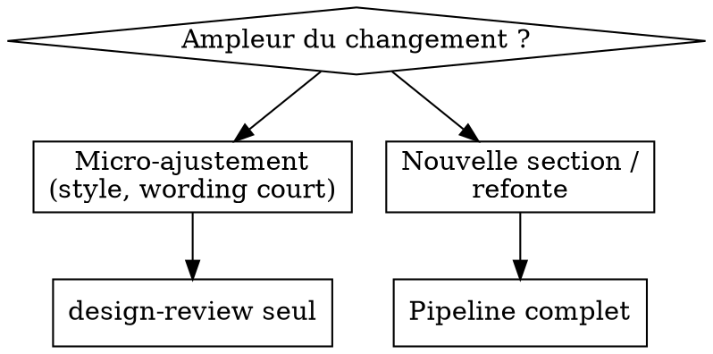

# Pipeline UX guidé

## Objectif
Accompagner la création d'une feature UI de la stratégie à la vérification, avec un point de validation humaine à chaque étape.

## Pré-requis
Si `design.md` est absent à la racine, lance d'abord le skill `detect-design-system`.

## Routage dynamique
On n'exécute pas toujours les 5 phases. Adapte à l'ampleur :

## Phases (pipeline complet)
Chaque phase délègue à une persona, écrit un artefact, puis **s'arrête pour validation** (approval gate) avant la suivante.

1. **Stratégie** — `ux-strategist` → `docs/design/<feature-slug>/strategy.md` — **gate**
2. **Copy** — `ux-copywriter` → `docs/design/<feature-slug>/copy.md` — **gate**
3. **Layout** — `ui-designer` → `docs/design/<feature-slug>/layout.md` — **gate**
4. **Motion** — `motion-designer` → `docs/design/<feature-slug>/motion.md` — **gate**
5. **Vérification** — `design-reviewer` (skill `design-review`) → `docs/design/<feature-slug>/review-report.md`

## Approval gate (règle stricte)
À chaque gate : présente l'artefact, demande une validation **explicite**, n'enchaîne pas sans accord. Si l'utilisateur amende l'artefact, relance la persona concernée sur le fichier amendé.

## Handover
Chaque persona lit les artefacts des phases précédentes dans `docs/design/<feature-slug>/`. C'est le canal de transmission entre étapes.

## Red Flags — STOP
- Tu enchaînes deux phases sans validation explicite.
- Tu écris du code applicatif avant que `layout.md` soit validé.
- Tu conclus sans passer par `design-review`.
