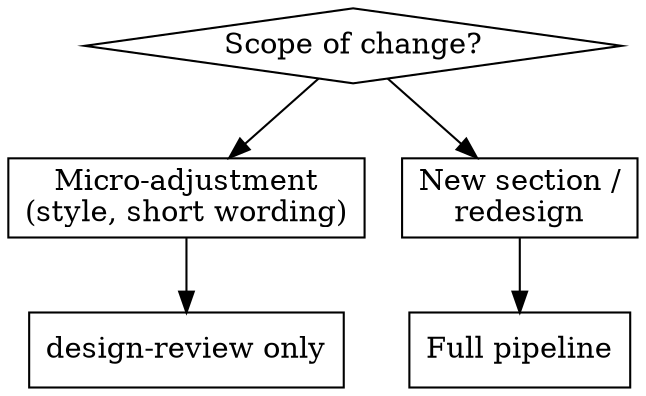

# Guided UX pipeline

## Objective
Guide the creation of a UI feature from strategy to verification, with a human validation point at each step.

## Prerequisites
If `design.md` is absent at the root, run the `detect-design-system` skill first.

## Dynamic routing
Not all 7 phases are always executed. Adapt to the scope:

## Phases (full pipeline)
Each phase delegates to a persona, writes an artefact, then **stops for validation** (approval gate) before the next.

1. **Strategy** — `ux-strategist` → `docs/design/<feature-slug>/strategy.md` — **gate**
2. **Copy** — `ux-copywriter` → `docs/design/<feature-slug>/copy.md` — **gate**
3. **Layout** — `ui-designer` → `docs/design/<feature-slug>/layout.md` — **gate**
4. **Motion** — `motion-designer` → `docs/design/<feature-slug>/motion.md` — **gate**
5. **Artefact review** — `design-reviewer` reads all docs (`strategy.md`, `copy.md`, `layout.md`, `motion.md`) and verifies their mutual coherence and quality before any code → `docs/design/<feature-slug>/review-report.md` — **gate**
5b. **Wireframe offer** *(mandatory question, optional output)* — after the artefact review gate, **always ask** the user: *"Would you like a visual HTML wireframe of the layout before implementation?"* If yes: `ui-designer` generates `docs/design/<feature-slug>/wireframe.html` based on `layout.md` and `copy.md` — **gate if generated**. If no: proceed to Phase 6. Never skip this question.
6. **Implementation** — translate `layout.md` + `motion.md` into code, **section by section**: one sub-section at a time, verify spec fidelity before moving on. Never implement the full feature in a single pass. — **gate**
7. **Render verification** — `design-reviewer` verifies code fidelity to specs and visual coherence of the result → updates `review-report.md`

## Resuming mid-pipeline
If artefacts already exist in `docs/design/<feature-slug>/`, check which files are present and skip completed phases:

| Files present | Start from |
|---|---|
| none | Phase 1 — Strategy |
| `strategy.md` | Phase 2 — Copy |
| + `copy.md` | Phase 3 — Layout |
| + `layout.md` | Phase 4 — Motion |
| + `motion.md` | Phase 5 — Artefact review |
| `review-report.md` with `READY FOR IMPLEMENTATION` | Phase 5b — Wireframe offer (ask before Phase 6) |
| Code exists but review-report has issues | Phase 6 — Fix implementation |

Always read existing artefacts before resuming to understand what was validated.

## Approval gate (strict rule)
At each gate: present the artefact, ask for **explicit** validation, do not proceed without agreement. If the user amends an artefact, re-run the relevant persona on the amended file.

When a gate rejection identifies an issue originating from an upstream artefact, fix the upstream artefact first (re-run the relevant persona on it), then regenerate the current one. Never patch a downstream file to work around an upstream problem.

## Handover
Each persona reads the artefacts from previous phases in `docs/design/<feature-slug>/`. That is the transmission channel between steps.

## Red Flags — STOP
- You chain two phases without explicit validation.
- You write application code before `layout.md` is validated.
- You implement the entire feature in a single pass without intermediate verification.
- You proceed to Phase 6 without having asked about the wireframe (step 5b).
- You conclude without going through `design-review`.
