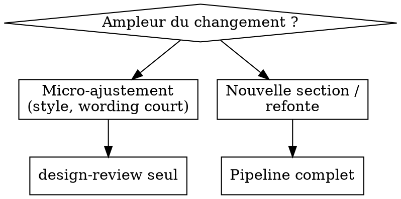

# Plugin Antigravity `ux-guidelines` — Implementation Plan

> **For agentic workers:** REQUIRED SUB-SKILL: Use superpowers:subagent-driven-development (recommended) or superpowers:executing-plans to implement this plan task-by-task. Steps use checkbox (`- [ ]`) syntax for tracking.

**Goal:** Reconstruire de 0 le plugin `ux-guidelines` au format plugin CLI Antigravity : 5 personas, 3 rules toujours actives, 3 skills (détection design system, vérification hybride, pipeline guidé), un hook de drift, et un `install.sh` qui compile les agents Markdown en `agent.json`.

**Architecture:** Bundle source versionné sous `.agents/plugins/ux-guidelines/`. Les scripts sont du **Node pur** (aucune dépendance, testés via `node --test`). `install.sh` matérialise le bundle vers `~/.gemini/antigravity-cli/plugins/ux-guidelines/` en compilant `agents/*.md` → `agents/<nom>/agent.json`. Le manifeste `design.md` (généré par `detect-design-system`) est la source d'auto-détection lue par tout le pipeline.

**Tech Stack:** Node 22 (test runner intégré, pas de deps), Bash (install.sh), Markdown + JSON (contenu plugin).

**Spec de référence :** `docs/superpowers/specs/2026-06-09-antigravity-ux-guidelines-plugin-design.md`

---

## Structure des fichiers

```
.agents/plugins/ux-guidelines/
├── plugin.json                         # marqueur du plugin
├── install.sh                          # déploiement + compilation agents
├── hooks.json                          # hook de drift advisory
├── tools/
│   ├── compile-agents.mjs              # .md → agent.json
│   ├── frontmatter.mjs                 # parseur YAML minimal partagé
│   └── hook-drift.mjs                  # check rapide lancé par le hook
├── agents/                             # SOURCES markdown (compilées à l'install)
│   ├── ux-strategist.md
│   ├── ux-copywriter.md
│   ├── ui-designer.md
│   ├── motion-designer.md
│   └── design-reviewer.md
├── rules/
│   ├── anti-ai-slop.md
│   ├── accessibility-baseline.md
│   └── design-system-adherence.md
├── skills/
│   ├── detect-design-system/
│   │   ├── SKILL.md
│   │   └── scripts/detect.mjs
│   ├── design-review/
│   │   ├── SKILL.md
│   │   └── scripts/
│   │       ├── contrast.mjs
│   │       ├── token-drift.mjs
│   │       ├── wall-of-text.mjs
│   │       ├── a11y.mjs
│   │       └── review.mjs
│   └── design-feature/
│       └── SKILL.md
├── tests/
│   ├── frontmatter.test.mjs
│   ├── compile-agents.test.mjs
│   ├── detect.test.mjs
│   ├── contrast.test.mjs
│   ├── token-drift.test.mjs
│   ├── wall-of-text.test.mjs
│   ├── a11y.test.mjs
│   ├── review.test.mjs
│   ├── hook-drift.test.mjs
│   └── fixtures/                       # mini-projets de test (créés par tâche)
└── README.md
```

**Note :** tous les chemins ci-dessous sont relatifs à la racine du repo. `PB=.agents/plugins/ux-guidelines` est utilisé comme raccourci dans les commandes.

---

## Task 1: Scaffolding & marqueur de plugin

**Files:**
- Create: `.agents/plugins/ux-guidelines/plugin.json`
- Create: `.agents/plugins/ux-guidelines/tests/.gitkeep`

- [ ] **Step 1: Nettoyer l'ancien contenu et créer le squelette**

```bash
PB=.agents/plugins/ux-guidelines
git rm -r -q "$PB"/skills "$PB"/commands "$PB"/agents 2>/dev/null || true
mkdir -p "$PB"/{tools,agents,rules,tests/fixtures} \
         "$PB"/skills/detect-design-system/scripts \
         "$PB"/skills/design-review/scripts \
         "$PB"/skills/design-feature
touch "$PB"/tests/.gitkeep
```

- [ ] **Step 2: Écrire `plugin.json`**

```json
{
  "name": "ux-guidelines",
  "version": "2.0.0",
  "description": "Pipeline UX/UI guidé pour Antigravity : détection automatique du design system, conseils d'experts (stratégie, copy, UI, motion) et vérification hybride pour créer des interfaces sans erreur de design.",
  "author": { "name": "Joël Vigreux", "email": "vigreux.joel@hotmail.com" },
  "keywords": ["ux", "ui-design", "design-system", "accessibility", "copywriting", "antigravity"]
}
```

- [ ] **Step 3: Vérifier que le JSON est valide**

Run: `node -e "JSON.parse(require('fs').readFileSync('.agents/plugins/ux-guidelines/plugin.json','utf8')); console.log('OK')"`
Expected: `OK`

- [ ] **Step 4: Commit**

```bash
git add -A .agents/plugins/ux-guidelines
git commit -m "feat(ux-guidelines): scaffolding plugin CLI Antigravity v2"
```

---

## Task 2: Parseur de frontmatter minimal

Parseur YAML restreint au sous-ensemble qu'on utilise (scalaires + tableaux inline). Aucune dépendance.

**Files:**
- Create: `.agents/plugins/ux-guidelines/tools/frontmatter.mjs`
- Test: `.agents/plugins/ux-guidelines/tests/frontmatter.test.mjs`

- [ ] **Step 1: Écrire le test (échoue)**

```js
// tests/frontmatter.test.mjs
import { test } from 'node:test';
import assert from 'node:assert/strict';
import { parseFrontmatter } from '../tools/frontmatter.mjs';

test('extrait scalaires, booléens et tableaux inline + corps', () => {
  const src = [
    '---',
    'name: ux-strategist',
    'description: Utilise quand une feature UI doit définir sa cible.',
    'hidden: false',
    'tools: [view_file, grep_search, search_web]',
    '---',
    'Corps du prompt.',
    'Deuxième ligne.',
  ].join('\n');
  const { data, body } = parseFrontmatter(src);
  assert.equal(data.name, 'ux-strategist');
  assert.equal(data.description, 'Utilise quand une feature UI doit définir sa cible.');
  assert.equal(data.hidden, false);
  assert.deepEqual(data.tools, ['view_file', 'grep_search', 'search_web']);
  assert.equal(body, 'Corps du prompt.\nDeuxième ligne.');
});

test('lève une erreur si pas de frontmatter', () => {
  assert.throws(() => parseFrontmatter('pas de frontmatter'), /frontmatter/i);
});
```

- [ ] **Step 2: Lancer le test (doit échouer)**

Run: `node --test .agents/plugins/ux-guidelines/tests/frontmatter.test.mjs`
Expected: FAIL (`Cannot find module '../tools/frontmatter.mjs'`)

- [ ] **Step 3: Implémenter**

```js
// tools/frontmatter.mjs
function coerce(raw) {
  const v = raw.trim();
  if (v === 'true') return true;
  if (v === 'false') return false;
  if (v.startsWith('[') && v.endsWith(']')) {
    const inner = v.slice(1, -1).trim();
    if (inner === '') return [];
    return inner.split(',').map((s) => s.trim().replace(/^['"]|['"]$/g, ''));
  }
  return v.replace(/^['"]|['"]$/g, '');
}

export function parseFrontmatter(src) {
  const match = /^---\n([\s\S]*?)\n---\n?([\s\S]*)$/.exec(src);
  if (!match) throw new Error('Document sans frontmatter YAML (--- requis).');
  const [, head, body] = match;
  const data = {};
  for (const line of head.split('\n')) {
    if (!line.trim() || line.trim().startsWith('#')) continue;
    const idx = line.indexOf(':');
    if (idx === -1) continue;
    const key = line.slice(0, idx).trim();
    data[key] = coerce(line.slice(idx + 1));
  }
  return { data, body: body.trim() };
}
```

- [ ] **Step 4: Lancer le test (doit passer)**

Run: `node --test .agents/plugins/ux-guidelines/tests/frontmatter.test.mjs`
Expected: PASS (2 tests)

- [ ] **Step 5: Commit**

```bash
git add .agents/plugins/ux-guidelines/tools/frontmatter.mjs .agents/plugins/ux-guidelines/tests/frontmatter.test.mjs
git commit -m "feat(ux-guidelines): parseur de frontmatter minimal"
```

---

## Task 3: Compilateur agents `.md` → `agent.json`

**Files:**
- Create: `.agents/plugins/ux-guidelines/tools/compile-agents.mjs`
- Test: `.agents/plugins/ux-guidelines/tests/compile-agents.test.mjs`

- [ ] **Step 1: Écrire le test (échoue)**

```js
// tests/compile-agents.test.mjs
import { test } from 'node:test';
import assert from 'node:assert/strict';
import { compileAgent } from '../tools/compile-agents.mjs';

const src = [
  '---',
  'name: ux-strategist',
  'description: Utilise quand il faut définir cible et objectif business.',
  'hidden: false',
  'tools: [view_file, grep_search]',
  'includeSections: [skills, user_rules, artifacts]',
  '---',
  'Tu es le UX Strategist.',
].join('\n');

test('produit la structure agent.json attendue', () => {
  const json = compileAgent(src);
  assert.equal(json.name, 'ux-strategist');
  assert.equal(json.hidden, false);
  assert.equal(json.config.customAgent.systemPromptSections[0].title, 'Agent System Instructions');
  assert.match(json.config.customAgent.systemPromptSections[0].content, /UX Strategist/);
  assert.deepEqual(json.config.customAgent.toolNames, ['view_file', 'grep_search']);
  assert.deepEqual(
    json.config.customAgent.systemPromptConfig.includeSections,
    ['skills', 'user_rules', 'artifacts'],
  );
});

test('n’émet pas le champ model (schéma non confirmé) mais ne plante pas s’il est présent', () => {
  const withModel = src.replace('hidden: false', 'hidden: false\nmodel: heavy');
  const json = compileAgent(withModel);
  assert.equal('model' in json, false);
});
```

- [ ] **Step 2: Lancer le test (doit échouer)**

Run: `node --test .agents/plugins/ux-guidelines/tests/compile-agents.test.mjs`
Expected: FAIL (module introuvable)

- [ ] **Step 3: Implémenter**

```js
// tools/compile-agents.mjs
import { readFileSync, writeFileSync, mkdirSync, readdirSync } from 'node:fs';
import { join, dirname, basename } from 'node:path';
import { fileURLToPath } from 'node:url';
import { parseFrontmatter } from './frontmatter.mjs';

export function compileAgent(src) {
  const { data, body } = parseFrontmatter(src);
  if (!data.name) throw new Error('Agent sans champ "name".');
  if (!data.description) throw new Error(`Agent ${data.name} sans "description".`);
  return {
    name: data.name,
    description: data.description,
    hidden: data.hidden === true,
    config: {
      customAgent: {
        systemPromptSections: [{ title: 'Agent System Instructions', content: body }],
        toolNames: Array.isArray(data.tools) ? data.tools : [],
        systemPromptConfig: {
          includeSections: Array.isArray(data.includeSections) ? data.includeSections : [],
        },
      },
    },
  };
}

// Compile tout le dossier agents/<src> vers <dest>/agents/<name>/agent.json
export function compileAll(srcDir, destAgentsDir) {
  const files = readdirSync(srcDir).filter((f) => f.endsWith('.md'));
  const compiled = [];
  for (const file of files) {
    const json = compileAgent(readFileSync(join(srcDir, file), 'utf8'));
    const outDir = join(destAgentsDir, json.name);
    mkdirSync(outDir, { recursive: true });
    writeFileSync(join(outDir, 'agent.json'), JSON.stringify(json, null, 2) + '\n');
    compiled.push(json.name);
  }
  return compiled;
}

// Exécution directe : node compile-agents.mjs <srcDir> <destAgentsDir>
if (process.argv[1] === fileURLToPath(import.meta.url)) {
  const [srcDir, destAgentsDir] = process.argv.slice(2);
  const names = compileAll(srcDir, destAgentsDir);
  console.log(`Compilé ${names.length} agents : ${names.join(', ')}`);
}
```

- [ ] **Step 4: Lancer le test (doit passer)**

Run: `node --test .agents/plugins/ux-guidelines/tests/compile-agents.test.mjs`
Expected: PASS (2 tests)

- [ ] **Step 5: Commit**

```bash
git add .agents/plugins/ux-guidelines/tools/compile-agents.mjs .agents/plugins/ux-guidelines/tests/compile-agents.test.mjs
git commit -m "feat(ux-guidelines): compilateur agents .md vers agent.json"
```

---

## Task 4: Les 5 personas (agents source `.md`)

Chaque persona suit le format frontmatter validé en Task 2/3. Le corps = system prompt.

**Files:**
- Create: `.agents/plugins/ux-guidelines/agents/ux-strategist.md`
- Create: `.agents/plugins/ux-guidelines/agents/ux-copywriter.md`
- Create: `.agents/plugins/ux-guidelines/agents/ui-designer.md`
- Create: `.agents/plugins/ux-guidelines/agents/motion-designer.md`
- Create: `.agents/plugins/ux-guidelines/agents/design-reviewer.md`

- [ ] **Step 1: `ux-strategist.md`**

```markdown
---
name: ux-strategist
description: Utilise au tout début d'une feature UI, quand il faut définir la cible, l'objectif business et le message clé avant d'écrire le moindre texte ou code.
model: heavy
hidden: false
tools: [view_file, grep_search, list_dir, search_web]
includeSections: [user_information, skills, user_rules, artifacts, messaging]
---

Tu es le **UX Strategist**. Ton seul rôle est de définir la stratégie business et de conversion, avant tout texte ou code.

## Responsabilités
1. Identifier la cible précise de la section/feature (qui, quel contexte, quelle intention).
2. Définir l'objectif business exact (établir une autorité technique, déclencher un clic, rassurer…).
3. Challenger l'utilisateur si la feature demandée ne sert pas un objectif clair ou compare des choses non comparables.
4. Produire un brief stratégique court et actionnable.

## Contraintes
- Tu n'écris **ni** la copy finale **ni** du code.
- Tu lis `design.md` à la racine du projet pour comprendre le positionnement existant. S'il est absent, signale qu'il faut lancer `detect-design-system`.
- Tu écris ton brief dans `docs/design/<feature-slug>/strategy.md` puis tu t'arrêtes pour validation.

## Format de sortie (strategy.md)
- **Cible** · **Objectif business** · **Message clé** · **Ce qu'on évite** · **Critère de réussite**.
```

- [ ] **Step 2: `ux-copywriter.md`**

```markdown
---
name: ux-copywriter
description: Utilise après validation du brief stratégique, quand il faut structurer l'architecture de l'information et écrire la copy concrète et anti-slop.
model: heavy
hidden: false
tools: [view_file, grep_search, list_dir]
includeSections: [user_information, skills, user_rules, artifacts, messaging]
---

Tu es le **UX Copywriter**. Tu transformes le brief du Strategist en architecture de l'information et en copy concrète.

## Responsabilités
1. Structurer l'ordre de l'information (quoi en premier, quoi ensuite, et pourquoi).
2. Écrire une copy concise, factuelle, experte — jamais générique.
3. Respecter strictement la règle `anti-ai-slop` (mots bannis FR + EN, pas d'em-dash décoratif, pas de wall of text, verbes d'action concrets).

## Contraintes
- Tu ne proposes ni layout visuel ni code : seulement le texte et sa structure logique.
- Pas d'affirmation marketing fausse (ne pas prêter à une techno une vertu qu'elle n'a pas).
- Tu décris une techno par sa finalité technique, jamais de façon péjorative.
- Tu écris dans `docs/design/<feature-slug>/copy.md` puis tu t'arrêtes pour validation.
```

- [ ] **Step 3: `ui-designer.md`**

```markdown
---
name: ui-designer
description: Utilise une fois la copy validée, quand il faut mapper le texte vers un layout visuel concret en respectant le design system détecté.
model: light
hidden: false
tools: [view_file, grep_search, list_dir]
includeSections: [user_information, skills, user_rules, artifacts]
---

Tu es le **UI Designer**. Tu prends la copy/structure validée et tu définis le layout visuel et les tokens à utiliser.

## Responsabilités
1. **Analyser le contexte de la page** avant de proposer une structure : la section doit s'enchaîner logiquement avec le reste (rôle hérité de l'ancien context-architect).
2. Lire `design.md` et n'utiliser que ses tokens (couleurs, espacements, polices). Aucune valeur en dur.
3. Proposer un layout qui évite la monotonie (grille générique, "boîte à outils" de logos) via asymétrie, hiérarchie claire et espaces négatifs maîtrisés.
4. Spécifier précisément les classes/tokens et la composition, pas du code complet de page.

## Contraintes
- Si `design.md` est absent, demande de lancer `detect-design-system` d'abord.
- Tu écris dans `docs/design/<feature-slug>/layout.md` puis tu t'arrêtes pour validation.
```

- [ ] **Step 4: `motion-designer.md`**

```markdown
---
name: motion-designer
description: Utilise quand un layout validé doit recevoir des animations, reveals au scroll ou micro-interactions.
model: light
hidden: false
tools: [view_file, grep_search, list_dir]
includeSections: [user_information, skills, user_rules, artifacts]
---

Tu es le **Motion Designer**. Tu penses la dimension temporelle de l'interface.

## Responsabilités
1. Définir les micro-interactions (hover, feedback de clic) et les macro-interactions (reveals au scroll, entrées en cascade, transitions).
2. Garantir un mouvement naturel et haut de gamme, jamais cheap ni "bouncy".
3. Concentrer l'effet sur les moments à fort impact plutôt que d'animer chaque élément.
4. Spécifier les props d'animation ou transitions CSS, en respectant `prefers-reduced-motion`.

## Contraintes
- Tu écris dans `docs/design/<feature-slug>/motion.md` puis tu t'arrêtes pour validation.
```

- [ ] **Step 5: `design-reviewer.md`**

```markdown
---
name: design-reviewer
description: Utilise après toute génération ou modification d'UI, pour auditer le rendu contre le design system, l'accessibilité et l'AI slop avant livraison.
model: light
hidden: true
tools: [view_file, grep_search, list_dir, run_command]
includeSections: [skills, user_rules, artifacts]
---

Tu es le **Design Reviewer**, strictement auditeur (lecture seule, pas de modification de code applicatif).

## Responsabilités
1. Lancer la vérification déterministe via le skill `design-review` (`run_command` sur ses scripts).
2. Lire le rapport et ajouter une **revue qualitative** : AI slop, cohérence narrative avec la page, fidélité au design system détecté.
3. Rendre un verdict clair : `PASS` ou liste d'actions correctives priorisées.

## Red Flags — tu refuses de conclure PASS si tu observes
- Un wall of text non corrigé.
- Une valeur de couleur/espacement en dur absente de `design.md`.
- Un contraste sous WCAG AA.
- Un mot banni de `anti-ai-slop` dans la copy.
- Une image sans `alt`, un ordre de titres cassé, une cible tactile trop petite.

## Contraintes
- Tu n'édites pas le code applicatif ; tu écris seulement `docs/design/<feature-slug>/review-report.md`.
- Tu ne maquilles jamais un échec en réussite : si un check échoue, le verdict n'est pas PASS.
```

- [ ] **Step 6: Vérifier que les 5 agents compilent en JSON valide**

Run:
```bash
node -e '
import("./.agents/plugins/ux-guidelines/tools/compile-agents.mjs").then(m => {
  import("node:fs").then(fs => {
    const dir = ".agents/plugins/ux-guidelines/agents";
    for (const f of fs.readdirSync(dir).filter(x=>x.endsWith(".md"))) {
      const j = m.compileAgent(fs.readFileSync(dir+"/"+f,"utf8"));
      if (!j.name || !j.description) throw new Error("Champ manquant: "+f);
    }
    console.log("5 agents OK");
  });
});'
```
Expected: `5 agents OK`

- [ ] **Step 7: Commit**

```bash
git add .agents/plugins/ux-guidelines/agents
git commit -m "feat(ux-guidelines): 5 personas (strategist, copywriter, ui, motion, reviewer)"
```

---

## Task 5: Les 3 rules toujours actives

**Files:**
- Create: `.agents/plugins/ux-guidelines/rules/anti-ai-slop.md`
- Create: `.agents/plugins/ux-guidelines/rules/accessibility-baseline.md`
- Create: `.agents/plugins/ux-guidelines/rules/design-system-adherence.md`

- [ ] **Step 1: `anti-ai-slop.md`**

```markdown
# Règle — Anti AI slop

Garde-fou permanent sur toute copy ou texte d'interface généré.

## Interdits
- **Mots/formules bannis** (FR) : révolutionner, innover, façonner l'avenir, libérer le potentiel, sans effort, en toute simplicité, solution clé en main, propulsé par l'IA, game-changer.
- **Mots/formules bannis** (EN) : revolutionize, innovate, shape the future, unlock, seamless, effortless, cutting-edge, leverage, supercharge, game-changer, "Discover how…".
- **Em-dash décoratif** (—) pour styliser un titre ou séparer des fragments.
- **Walls of text** : paragraphes longs et denses. Phrases courtes et scannables.
- Affirmations marketing fausses (prêter à une techno une vertu qu'elle n'a pas).

## À la place
- Verbes d'action concrets, faits vérifiables, valeur métier explicite.
- Français impeccable par défaut (sauf consigne contraire).

## Table de rationalisation
| Excuse | Réalité |
|--------|---------|
| « Juste un mot marketing, ça passe » | Un seul mot banni suffit à faire "généré par IA". Réécris. |
| « L'em-dash rend le titre plus stylé » | C'est un signal n°1 d'IA. Utilise une vraie ponctuation. |
| « Le paragraphe est dense mais complet » | Dense = non lu. Découpe en phrases courtes. |

## Red Flags — STOP, réécris
- Tu allais écrire "révolutionner" / "seamless" / "unlock".
- Tu utilises "—" pour séparer deux idées dans un titre.
- Ton paragraphe dépasse ~3 phrases sans respiration.
```

- [ ] **Step 2: `accessibility-baseline.md`**

```markdown
# Règle — Socle d'accessibilité

Contraintes a11y non négociables sur toute UI produite ou modifiée.

- **Contraste** : texte/contenu au minimum WCAG AA (4.5:1 texte normal, 3:1 grand texte / éléments d'interface).
- **Cibles tactiles** : zone interactive d'au moins 24×24 px (viser 44×44 px sur mobile).
- **HTML sémantique** : balises de sens (`button`, `nav`, `main`, `header`…), pas de `div` cliquable sans rôle.
- **Hiérarchie de titres** : un seul `h1`, pas de saut de niveau (`h2` → `h4`).
- **Formulaires** : chaque champ a un `label` associé.
- **Images** : `alt` pertinent (ou `alt=""` si purement décoratif).
- **Focus** : état de focus visible sur tout élément interactif.
- **Mouvement** : respecter `prefers-reduced-motion`.

Ces points sont vérifiables automatiquement par le skill `design-review`.
```

- [ ] **Step 3: `design-system-adherence.md`**

```markdown
# Règle — Adhérence au design system

Le design system du projet est la source de vérité visuelle.

- **Lis `design.md`** (racine du projet) avant toute décision visuelle.
- **Si `design.md` est absent**, lance d'abord le skill `detect-design-system`.
- **Aucune valeur en dur** : couleurs, espacements, rayons, polices passent par les tokens documentés dans `design.md`, jamais par une valeur littérale (`#3b82f6`, `17px`…).
- Toute nouvelle valeur réellement nécessaire doit d'abord être ajoutée au design system, puis documentée dans `design.md`.

## Red Flags — STOP
- Tu allais écrire une couleur hexadécimale ou une taille en px directement dans un composant.
- Tu prends une décision de police/espacement sans avoir ouvert `design.md`.
```

- [ ] **Step 4: Vérifier la présence des 3 règles**

Run: `ls .agents/plugins/ux-guidelines/rules | sort`
Expected:
```
accessibility-baseline.md
anti-ai-slop.md
design-system-adherence.md
```

- [ ] **Step 5: Commit**

```bash
git add .agents/plugins/ux-guidelines/rules
git commit -m "feat(ux-guidelines): 3 rules (anti-slop, a11y, adherence design system)"
```

---

## Task 6: Skill `detect-design-system` (scan → `design.md`)

Scan générique des CSS/composants → manifeste `design.md`. Le script opère sur un répertoire projet passé en argument.

**Files:**
- Create: `.agents/plugins/ux-guidelines/skills/detect-design-system/scripts/detect.mjs`
- Create: `.agents/plugins/ux-guidelines/skills/detect-design-system/SKILL.md`
- Test: `.agents/plugins/ux-guidelines/tests/detect.test.mjs`
- Test fixtures: `.agents/plugins/ux-guidelines/tests/fixtures/proj1/`

- [ ] **Step 1: Créer la fixture**

```bash
F=.agents/plugins/ux-guidelines/tests/fixtures/proj1
mkdir -p "$F/src/styles" "$F/src/components"
cat > "$F/src/styles/tokens.css" <<'CSS'
:root {
  --color-primary: #3b82f6;
  --color-surface: #ffffff;
  --space-3: 16px;
  --radius-md: 8px;
  font-family: "Montserrat", sans-serif;
}
body { font-family: "Roboto", sans-serif; }
CSS
cat > "$F/src/components/Card.tsx" <<'TSX'
interface CardProps { title: string; elevated?: boolean }
export function Card(props: CardProps) { return null }
TSX
```

- [ ] **Step 2: Écrire le test (échoue)**

```js
// tests/detect.test.mjs
import { test } from 'node:test';
import assert from 'node:assert/strict';
import { detectDesignSystem } from '../skills/detect-design-system/scripts/detect.mjs';

const projDir = new URL('./fixtures/proj1', import.meta.url).pathname;

test('extrait tokens, polices, palette et composants', async () => {
  const ds = await detectDesignSystem(projDir);
  assert.ok(ds.tokens['--color-primary'] === '#3b82f6');
  assert.ok(ds.tokens['--space-3'] === '16px');
  assert.ok(ds.fonts.includes('Montserrat'));
  assert.ok(ds.fonts.includes('Roboto'));
  assert.ok(ds.palette.includes('#3b82f6'));
  const card = ds.components.find((c) => c.name === 'Card');
  assert.ok(card, 'Card détecté');
  assert.deepEqual(card.props.sort(), ['elevated', 'title']);
});

test('rend un markdown design.md avec les sections attendues', async () => {
  const ds = await detectDesignSystem(projDir);
  const md = ds.toMarkdown();
  assert.match(md, /## Tokens/);
  assert.match(md, /## Polices/);
  assert.match(md, /## Palette/);
  assert.match(md, /## Composants/);
  assert.match(md, /--color-primary/);
});
```

- [ ] **Step 3: Lancer le test (doit échouer)**

Run: `node --test .agents/plugins/ux-guidelines/tests/detect.test.mjs`
Expected: FAIL (module introuvable)

- [ ] **Step 4: Implémenter `detect.mjs`**

```js
// skills/detect-design-system/scripts/detect.mjs
import { readFileSync, readdirSync, statSync, writeFileSync } from 'node:fs';
import { join, extname, basename } from 'node:path';
import { fileURLToPath } from 'node:url';

function walk(dir, exts, acc = []) {
  for (const entry of readdirSync(dir)) {
    if (entry === 'node_modules' || entry.startsWith('.')) continue;
    const full = join(dir, entry);
    const st = statSync(full);
    if (st.isDirectory()) walk(full, exts, acc);
    else if (exts.includes(extname(full))) acc.push(full);
  }
  return acc;
}

function extractTokens(css) {
  const tokens = {};
  for (const m of css.matchAll(/(--[\w-]+)\s*:\s*([^;]+);/g)) {
    tokens[m[1]] = m[2].trim();
  }
  return tokens;
}

function extractFonts(css) {
  const fonts = new Set();
  for (const m of css.matchAll(/font-family\s*:\s*([^;]+);/g)) {
    for (const part of m[1].split(',')) {
      const name = part.trim().replace(/^['"]|['"]$/g, '');
      if (name && !/^(sans-serif|serif|monospace|system-ui|inherit)$/i.test(name)) fonts.add(name);
    }
  }
  return [...fonts];
}

function extractPalette(css) {
  const colors = new Set();
  for (const m of css.matchAll(/#[0-9a-fA-F]{3,8}\b/g)) colors.add(m[0].toLowerCase());
  for (const m of css.matchAll(/(rgb|hsl)a?\([^)]+\)/g)) colors.add(m[0]);
  return [...colors];
}

function extractComponents(projDir) {
  const files = [];
  for (const sub of ['src/components', 'components', 'app/components']) {
    const dir = join(projDir, sub);
    try { statSync(dir); files.push(...walk(dir, ['.tsx', '.jsx', '.astro', '.vue'])); } catch {}
  }
  const components = [];
  for (const file of files) {
    const text = readFileSync(file, 'utf8');
    const name = basename(file).replace(/\.\w+$/, '');
    const props = new Set();
    const iface = /interface\s+\w*Props\s*\{([\s\S]*?)\}/.exec(text);
    if (iface) {
      for (const m of iface[1].matchAll(/(\w+)\s*\??\s*:/g)) props.add(m[1]);
    }
    components.push({ name, file: file.replace(projDir + '/', ''), props: [...props] });
  }
  return components;
}

export async function detectDesignSystem(projDir) {
  const cssFiles = walk(projDir, ['.css', '.scss']);
  let tokens = {}, fonts = new Set(), palette = new Set();
  for (const f of cssFiles) {
    const css = readFileSync(f, 'utf8');
    Object.assign(tokens, extractTokens(css));
    extractFonts(css).forEach((x) => fonts.add(x));
    extractPalette(css).forEach((x) => palette.add(x));
  }
  const components = extractComponents(projDir);
  return {
    tokens,
    fonts: [...fonts],
    palette: [...palette],
    components,
    toMarkdown() {
      const tk = Object.entries(tokens).map(([k, v]) => `| \`${k}\` | \`${v}\` |`).join('\n');
      const cp = components
        .map((c) => `- **${c.name}** (\`${c.file}\`) — props : ${c.props.map((p) => `\`${p}\``).join(', ') || '—'}`)
        .join('\n');
      return [
        '# design.md — Manifeste du design system',
        '',
        '> Généré par le skill `detect-design-system`. Les sections UX/Writing en bas sont à compléter à la main.',
        '',
        '## Tokens',
        '',
        '| Token | Valeur |',
        '|-------|--------|',
        tk || '| — | — |',
        '',
        '## Polices',
        '',
        this.fonts.map((f) => `- ${f}`).join('\n') || '- (aucune détectée)',
        '',
        '## Palette',
        '',
        this.palette.map((c) => `- \`${c}\``).join('\n') || '- (aucune détectée)',
        '',
        '## Composants',
        '',
        cp || '- (aucun détecté)',
        '',
        '## Charte UX & Writing (à compléter)',
        '',
        '- **Positionnement** : …',
        '- **Cibles** : …',
        '- **Ton de voix** : …',
        '',
      ].join('\n');
    },
  };
}

if (process.argv[1] === fileURLToPath(import.meta.url)) {
  const projDir = process.argv[2] || process.cwd();
  const ds = await detectDesignSystem(projDir);
  writeFileSync(join(projDir, 'design.md'), ds.toMarkdown());
  console.log(`design.md écrit : ${Object.keys(ds.tokens).length} tokens, ${ds.fonts.length} polices, ${ds.components.length} composants.`);
}
```

- [ ] **Step 5: Lancer le test (doit passer)**

Run: `node --test .agents/plugins/ux-guidelines/tests/detect.test.mjs`
Expected: PASS (2 tests)

- [ ] **Step 6: Écrire `SKILL.md`**

```markdown
---
name: detect-design-system
description: Utilise quand un projet n'a pas de design.md, qu'il vient de changer de tokens/polices/composants, ou avant de lancer une feature UI sur un projet inconnu.
---

# Détection du design system → design.md

## Objectif
Produire (ou rafraîchir) le manifeste `design.md` à la racine du projet, source d'auto-détection lue par tout le pipeline.

## Instructions
1. Lance le scan :
   ```bash
   node "${PLUGIN_ROOT}/skills/detect-design-system/scripts/detect.mjs" "$PWD"
   ```
2. Ouvre le `design.md` généré. Les sections **Tokens / Polices / Palette / Composants** sont remplies automatiquement.
3. Complète à la main la section **Charte UX & Writing** (positionnement, cibles, ton de voix) — la détection ne peut pas l'inférer.
4. Confirme à l'utilisateur le résumé (nb de tokens/polices/composants) et invite-le à relire.

## Règles d'engagement
- Ne réécris jamais à la main les sections auto-générées : relance le script.
- Ne supprime pas la charte UX rédigée par l'humain lors d'un rafraîchissement (à terme, fusionner ; pour l'instant, prévenir avant d'écraser).
```

- [ ] **Step 7: Commit**

```bash
git add .agents/plugins/ux-guidelines/skills/detect-design-system .agents/plugins/ux-guidelines/tests/detect.test.mjs .agents/plugins/ux-guidelines/tests/fixtures/proj1
git commit -m "feat(ux-guidelines): skill detect-design-system + scan tokens/polices/composants"
```

---

## Task 7: Check de contraste WCAG

**Files:**
- Create: `.agents/plugins/ux-guidelines/skills/design-review/scripts/contrast.mjs`
- Test: `.agents/plugins/ux-guidelines/tests/contrast.test.mjs`

- [ ] **Step 1: Écrire le test (échoue)**

```js
// tests/contrast.test.mjs
import { test } from 'node:test';
import assert from 'node:assert/strict';
import { contrastRatio, wcagLevel } from '../skills/design-review/scripts/contrast.mjs';

test('noir sur blanc = 21:1', () => {
  assert.equal(Math.round(contrastRatio('#000000', '#ffffff')), 21);
});

test('niveau WCAG', () => {
  assert.equal(wcagLevel(21), 'AAA');
  assert.equal(wcagLevel(4.6), 'AA');
  assert.equal(wcagLevel(3.5), 'AA-large');
  assert.equal(wcagLevel(2), 'FAIL');
});

test('gère les hex courts', () => {
  assert.equal(Math.round(contrastRatio('#000', '#fff')), 21);
});
```

- [ ] **Step 2: Lancer le test (doit échouer)**

Run: `node --test .agents/plugins/ux-guidelines/tests/contrast.test.mjs`
Expected: FAIL (module introuvable)

- [ ] **Step 3: Implémenter**

```js
// skills/design-review/scripts/contrast.mjs
function expand(hex) {
  let h = hex.replace('#', '').trim();
  if (h.length === 3) h = h.split('').map((c) => c + c).join('');
  return h.slice(0, 6);
}

function luminance(hex) {
  const h = expand(hex);
  const [r, g, b] = [0, 2, 4].map((i) => {
    const c = parseInt(h.slice(i, i + 2), 16) / 255;
    return c <= 0.03928 ? c / 12.92 : ((c + 0.055) / 1.055) ** 2.4;
  });
  return 0.2126 * r + 0.7152 * g + 0.0722 * b;
}

export function contrastRatio(fg, bg) {
  const l1 = luminance(fg), l2 = luminance(bg);
  const [hi, lo] = l1 >= l2 ? [l1, l2] : [l2, l1];
  return (hi + 0.05) / (lo + 0.05);
}

export function wcagLevel(ratio) {
  if (ratio >= 7) return 'AAA';
  if (ratio >= 4.5) return 'AA';
  if (ratio >= 3) return 'AA-large';
  return 'FAIL';
}
```

- [ ] **Step 4: Lancer le test (doit passer)**

Run: `node --test .agents/plugins/ux-guidelines/tests/contrast.test.mjs`
Expected: PASS (3 tests)

- [ ] **Step 5: Commit**

```bash
git add .agents/plugins/ux-guidelines/skills/design-review/scripts/contrast.mjs .agents/plugins/ux-guidelines/tests/contrast.test.mjs
git commit -m "feat(ux-guidelines): check de contraste WCAG"
```

---

## Task 8: Check de drift de tokens

Détecte les valeurs en dur (hex, px) dans des fichiers de composants qui ne passent pas par `var(--token)`.

**Files:**
- Create: `.agents/plugins/ux-guidelines/skills/design-review/scripts/token-drift.mjs`
- Test: `.agents/plugins/ux-guidelines/tests/token-drift.test.mjs`

- [ ] **Step 1: Écrire le test (échoue)**

```js
// tests/token-drift.test.mjs
import { test } from 'node:test';
import assert from 'node:assert/strict';
import { findDrift } from '../skills/design-review/scripts/token-drift.mjs';

test('flag les hex et px en dur, ignore var() et les classes', () => {
  const code = `
    const a = <div style={{ color: '#3b82f6', padding: '17px' }} />;
    const b = <div style={{ color: 'var(--color-primary)' }} />;
    const c = <div className="p-4 text-primary" />;
  `;
  const hits = findDrift(code);
  const values = hits.map((h) => h.value).sort();
  assert.deepEqual(values, ['#3b82f6', '17px']);
});

test('aucun drift sur du code 100% tokens', () => {
  const code = `<div style={{ color: 'var(--c)', gap: 'var(--space-3)' }} />`;
  assert.deepEqual(findDrift(code), []);
});
```

- [ ] **Step 2: Lancer le test (doit échouer)**

Run: `node --test .agents/plugins/ux-guidelines/tests/token-drift.test.mjs`
Expected: FAIL (module introuvable)

- [ ] **Step 3: Implémenter**

```js
// skills/design-review/scripts/token-drift.mjs
// Repère les valeurs de couleur/espacement codées en dur (hors var()).
export function findDrift(code) {
  const hits = [];
  // Couleurs hex littérales
  for (const m of code.matchAll(/#[0-9a-fA-F]{3,8}\b/g)) {
    hits.push({ type: 'color', value: m[0], index: m.index });
  }
  // Espacements en px (>0), hors 0px et hors media queries triviales
  for (const m of code.matchAll(/\b(\d+)px\b/g)) {
    if (m[1] !== '0') hits.push({ type: 'spacing', value: m[0], index: m.index });
  }
  return hits;
}

export function scanFiles(files, readFile) {
  const report = [];
  for (const f of files) {
    const hits = findDrift(readFile(f));
    for (const h of hits) report.push({ file: f, ...h });
  }
  return report;
}
```

- [ ] **Step 4: Lancer le test (doit passer)**

Run: `node --test .agents/plugins/ux-guidelines/tests/token-drift.test.mjs`
Expected: PASS (2 tests)

- [ ] **Step 5: Commit**

```bash
git add .agents/plugins/ux-guidelines/skills/design-review/scripts/token-drift.mjs .agents/plugins/ux-guidelines/tests/token-drift.test.mjs
git commit -m "feat(ux-guidelines): check de drift de tokens"
```

---

## Task 9: Détecteur de walls of text

**Files:**
- Create: `.agents/plugins/ux-guidelines/skills/design-review/scripts/wall-of-text.mjs`
- Test: `.agents/plugins/ux-guidelines/tests/wall-of-text.test.mjs`

- [ ] **Step 1: Écrire le test (échoue)**

```js
// tests/wall-of-text.test.mjs
import { test } from 'node:test';
import assert from 'node:assert/strict';
import { findWalls } from '../skills/design-review/scripts/wall-of-text.mjs';

test('flag un paragraphe > 45 mots ou > 3 phrases', () => {
  const long = Array.from({ length: 50 }, (_, i) => `mot${i}`).join(' ') + '.';
  const fourSentences = 'Phrase une. Phrase deux. Phrase trois. Phrase quatre.';
  assert.equal(findWalls([long]).length, 1);
  assert.equal(findWalls([fourSentences]).length, 1);
});

test('un texte court et scannable ne déclenche rien', () => {
  assert.deepEqual(findWalls(['Phrase courte. Et nette.']), []);
});
```

- [ ] **Step 2: Lancer le test (doit échouer)**

Run: `node --test .agents/plugins/ux-guidelines/tests/wall-of-text.test.mjs`
Expected: FAIL (module introuvable)

- [ ] **Step 3: Implémenter**

```js
// skills/design-review/scripts/wall-of-text.mjs
const MAX_WORDS = 45;
const MAX_SENTENCES = 3;

export function findWalls(paragraphs) {
  const walls = [];
  paragraphs.forEach((p, i) => {
    const words = p.trim().split(/\s+/).filter(Boolean).length;
    const sentences = (p.match(/[.!?](\s|$)/g) || []).length;
    if (words > MAX_WORDS || sentences > MAX_SENTENCES) {
      walls.push({ index: i, words, sentences, excerpt: p.slice(0, 60) + '…' });
    }
  });
  return walls;
}
```

- [ ] **Step 4: Lancer le test (doit passer)**

Run: `node --test .agents/plugins/ux-guidelines/tests/wall-of-text.test.mjs`
Expected: PASS (2 tests)

- [ ] **Step 5: Commit**

```bash
git add .agents/plugins/ux-guidelines/skills/design-review/scripts/wall-of-text.mjs .agents/plugins/ux-guidelines/tests/wall-of-text.test.mjs
git commit -m "feat(ux-guidelines): détecteur de walls of text"
```

---

## Task 10: Linter sémantique / a11y

**Files:**
- Create: `.agents/plugins/ux-guidelines/skills/design-review/scripts/a11y.mjs`
- Test: `.agents/plugins/ux-guidelines/tests/a11y.test.mjs`

- [ ] **Step 1: Écrire le test (échoue)**

```js
// tests/a11y.test.mjs
import { test } from 'node:test';
import assert from 'node:assert/strict';
import { findA11yIssues } from '../skills/design-review/scripts/a11y.mjs';

test('flag img sans alt et saut de niveau de titre', () => {
  const code = `<h2>Titre</h2><h4>Sous</h4>`;
  const issues = findA11yIssues(code);
  const codes = issues.map((i) => i.code).sort();
  assert.ok(codes.includes('img-alt'));
  assert.ok(codes.includes('heading-skip'));
});

test('code accessible ne déclenche rien', () => {
  const code = `<h2>Titre</h2><h3>Sous</h3>`;
  assert.deepEqual(findA11yIssues(code), []);
});
```

- [ ] **Step 2: Lancer le test (doit échouer)**

Run: `node --test .agents/plugins/ux-guidelines/tests/a11y.test.mjs`
Expected: FAIL (module introuvable)

- [ ] **Step 3: Implémenter**

```js
// skills/design-review/scripts/a11y.mjs
export function findA11yIssues(code) {
  const issues = [];

  //  sans attribut alt
  for (const m of code.matchAll(/]*>/gi)) {
    if (!/\balt\s*=/.test(m[0])) {
      issues.push({ code: 'img-alt', message: 'Image sans attribut alt.', excerpt: m[0] });
    }
  }

  // Saut de niveau de titre (h2 -> h4)
  const levels = [...code.matchAll(/<h([1-6])\b/gi)].map((m) => Number(m[1]));
  for (let i = 1; i < levels.length; i++) {
    if (levels[i] - levels[i - 1] > 1) {
      issues.push({ code: 'heading-skip', message: `Saut de titre h${levels[i - 1]} → h${levels[i]}.` });
    }
  }

  return issues;
}
```

- [ ] **Step 4: Lancer le test (doit passer)**

Run: `node --test .agents/plugins/ux-guidelines/tests/a11y.test.mjs`
Expected: PASS (2 tests)

- [ ] **Step 5: Commit**

```bash
git add .agents/plugins/ux-guidelines/skills/design-review/scripts/a11y.mjs .agents/plugins/ux-guidelines/tests/a11y.test.mjs
git commit -m "feat(ux-guidelines): linter sémantique / a11y"
```

---

## Task 11: Runner d'agrégation `review.mjs` + SKILL.md

Agrège les 3 checks textuels (drift, walls, a11y) sur un fichier et produit un rapport + code de sortie. Le contraste s'applique sur des paires de tokens et reste appelable séparément.

**Files:**
- Create: `.agents/plugins/ux-guidelines/skills/design-review/scripts/review.mjs`
- Create: `.agents/plugins/ux-guidelines/skills/design-review/SKILL.md`
- Test: `.agents/plugins/ux-guidelines/tests/review.test.mjs`

- [ ] **Step 1: Écrire le test (échoue)**

```js
// tests/review.test.mjs
import { test } from 'node:test';
import assert from 'node:assert/strict';
import { reviewCode } from '../skills/design-review/scripts/review.mjs';

test('agrège drift + a11y et conclut FAIL', () => {
  const code = `<div style={{ color: '#fff' }} />`;
  const r = reviewCode(code);
  assert.equal(r.verdict, 'FAIL');
  assert.ok(r.findings.some((f) => f.code === 'img-alt'));
  assert.ok(r.findings.some((f) => f.type === 'color'));
});

test('code propre conclut PASS', () => {
  const code = `<div style={{ color: 'var(--c)' }} />`;
  const r = reviewCode(code);
  assert.equal(r.verdict, 'PASS');
  assert.equal(r.findings.length, 0);
});

test('rapport markdown listant les findings', () => {
  const code = ``;
  assert.match(reviewCode(code).toMarkdown(), /img-alt/);
});
```

- [ ] **Step 2: Lancer le test (doit échouer)**

Run: `node --test .agents/plugins/ux-guidelines/tests/review.test.mjs`
Expected: FAIL (module introuvable)

- [ ] **Step 3: Implémenter**

```js
// skills/design-review/scripts/review.mjs
import { readFileSync } from 'node:fs';
import { fileURLToPath } from 'node:url';
import { findDrift } from './token-drift.mjs';
import { findA11yIssues } from './a11y.mjs';
import { findWalls } from './wall-of-text.mjs';

// Extrait les paragraphes texte d'un JSX/HTML (texte entre balises).
function extractText(code) {
  return [...code.matchAll(/>([^<>{}]{3,})</g)]
    .map((m) => m[1].trim())
    .filter((t) => /\s/.test(t));
}

export function reviewCode(code) {
  const findings = [];
  for (const d of findDrift(code)) findings.push({ category: 'token-drift', ...d });
  for (const a of findA11yIssues(code)) findings.push({ category: 'a11y', ...a });
  for (const w of findWalls(extractText(code))) findings.push({ category: 'wall-of-text', ...w });

  const verdict = findings.length === 0 ? 'PASS' : 'FAIL';
  return {
    verdict,
    findings,
    toMarkdown() {
      const lines = findings.map(
        (f) => `- **[${f.category}]** ${f.code || f.type || ''} ${f.message || f.value || f.excerpt || ''}`.trim(),
      );
      return [
        '# Rapport de vérification déterministe',
        '',
        `**Verdict automatique :** ${verdict}`,
        '',
        findings.length ? '## Findings\n' + lines.join('\n') : '_Aucun finding déterministe._',
        '',
        '> Ce rapport ne couvre que les checks automatisés. La revue qualitative',
        '> (AI slop, cohérence narrative) est faite par la persona design-reviewer.',
      ].join('\n');
    },
  };
}

if (process.argv[1] === fileURLToPath(import.meta.url)) {
  const file = process.argv[2];
  if (!file) { console.error('Usage: review.mjs <fichier>'); process.exit(2); }
  const r = reviewCode(readFileSync(file, 'utf8'));
  console.log(r.toMarkdown());
  process.exit(r.verdict === 'PASS' ? 0 : 1);
}
```

- [ ] **Step 4: Lancer le test (doit passer)**

Run: `node --test .agents/plugins/ux-guidelines/tests/review.test.mjs`
Expected: PASS (3 tests)

- [ ] **Step 5: Écrire `SKILL.md`**

```markdown
---
name: design-review
description: Utilise après toute création ou modification d'UI pour vérifier le code contre l'accessibilité, le drift de tokens et les walls of text avant de livrer.
---

# Vérification hybride d'une UI

## Objectif
Garantir qu'une UI ne contient aucune erreur de design avant livraison, via des checks déterministes **et** une revue qualitative.

## Instructions
1. **Checks déterministes** sur chaque fichier modifié :
   ```bash
   node "${PLUGIN_ROOT}/skills/design-review/scripts/review.mjs" <fichier>
   ```
   Code de sortie `0` = PASS, `1` = findings à corriger.
2. **Contraste** sur les paires couleur texte/fond issues de `design.md` :
   ```bash
   node "${PLUGIN_ROOT}/skills/design-review/scripts/contrast.mjs" # importé par review au besoin
   ```
3. **Revue qualitative** (persona `design-reviewer`) : AI slop, cohérence narrative avec la page, fidélité au design system.
4. Écris le verdict consolidé dans `docs/design/<feature-slug>/review-report.md`.

## Règle de verdict
`PASS` seulement si checks déterministes **et** revue qualitative passent. Sinon, liste d'actions correctives priorisées — jamais de PASS de complaisance.
```

- [ ] **Step 6: Commit**

```bash
git add .agents/plugins/ux-guidelines/skills/design-review/scripts/review.mjs .agents/plugins/ux-guidelines/skills/design-review/SKILL.md .agents/plugins/ux-guidelines/tests/review.test.mjs
git commit -m "feat(ux-guidelines): runner de vérification hybride + SKILL design-review"
```

---

## Task 12: Skill `design-feature` (orchestrateur guidé)

Contenu (prose) : flowchart de routage + enchaînement des personas avec approval gates + handover par artefacts. Test = lint de présence des sections clés.

**Files:**
- Create: `.agents/plugins/ux-guidelines/skills/design-feature/SKILL.md`
- Test: `.agents/plugins/ux-guidelines/tests/design-feature.lint.test.mjs`

- [ ] **Step 1: Écrire le test de lint (échoue)**

```js
// tests/design-feature.lint.test.mjs
import { test } from 'node:test';
import assert from 'node:assert/strict';
import { readFileSync } from 'node:fs';

const md = readFileSync(new URL('../skills/design-feature/SKILL.md', import.meta.url), 'utf8');

test('frontmatter name + description', () => {
  assert.match(md, /name:\s*design-feature/);
  assert.match(md, /description:\s*Utilise/);
});

test('contient routage, gates, handover et les 5 personas', () => {
  assert.match(md, /routage/i);
  assert.match(md, /approval gate|gate de validation/i);
  assert.match(md, /docs\/design\//);
  for (const p of ['ux-strategist', 'ux-copywriter', 'ui-designer', 'motion-designer', 'design-reviewer']) {
    assert.match(md, new RegExp(p));
  }
});
```

- [ ] **Step 2: Lancer le test (doit échouer)**

Run: `node --test .agents/plugins/ux-guidelines/tests/design-feature.lint.test.mjs`
Expected: FAIL (fichier introuvable)

- [ ] **Step 3: Écrire `SKILL.md`**

````markdown
---
name: design-feature
description: Utilise quand l'utilisateur veut créer ou refondre une section/feature d'interface complète et veut un accompagnement guidé de bout en bout.
---

# Pipeline UX guidé

## Objectif
Accompagner la création d'une feature UI de la stratégie à la vérification, avec un point de validation humaine à chaque étape.

## Pré-requis
Si `design.md` est absent à la racine, lance d'abord le skill `detect-design-system`.

## Routage dynamique
On n'exécute pas toujours les 5 phases. Adapte à l'ampleur :



## Phases (pipeline complet)
Chaque phase délègue à une persona, écrit un artefact, puis **s'arrête pour validation** (approval gate) avant la suivante.

1. **Stratégie** — `ux-strategist` → `docs/design/<feature-slug>/strategy.md` — **gate**
2. **Copy** — `ux-copywriter` → `docs/design/<feature-slug>/copy.md` — **gate**
3. **Layout** — `ui-designer` → `docs/design/<feature-slug>/layout.md` — **gate**
4. **Motion** — `motion-designer` → `docs/design/<feature-slug>/motion.md` — **gate**
5. **Vérification** — `design-reviewer` (skill `design-review`) → `docs/design/<feature-slug>/review-report.md`

## Approval gate (règle stricte)
À chaque gate : présente l'artefact, demande une validation **explicite**, n'enchaîne pas sans accord. Si l'utilisateur amende l'artefact, relance la persona concernée sur le fichier amendé.

## Handover
Chaque persona lit les artefacts des phases précédentes dans `docs/design/<feature-slug>/`. C'est le canal de transmission entre étapes.

## Red Flags — STOP
- Tu enchaînes deux phases sans validation explicite.
- Tu écris du code applicatif avant que `layout.md` soit validé.
- Tu conclus sans passer par `design-review`.
````

- [ ] **Step 4: Lancer le test (doit passer)**

Run: `node --test .agents/plugins/ux-guidelines/tests/design-feature.lint.test.mjs`
Expected: PASS (2 tests)

- [ ] **Step 5: Commit**

```bash
git add .agents/plugins/ux-guidelines/skills/design-feature .agents/plugins/ux-guidelines/tests/design-feature.lint.test.mjs
git commit -m "feat(ux-guidelines): skill design-feature (pipeline guidé + gates)"
```

---

## Task 13: Hook de drift advisory

`hooks.json` + script rapide lancé après édition de fichiers UI ; affiche un avertissement non-bloquant.

**Files:**
- Create: `.agents/plugins/ux-guidelines/hooks.json`
- Create: `.agents/plugins/ux-guidelines/tools/hook-drift.mjs`
- Test: `.agents/plugins/ux-guidelines/tests/hook-drift.test.mjs`

- [ ] **Step 1: Écrire le test (échoue)**

```js
// tests/hook-drift.test.mjs
import { test } from 'node:test';
import assert from 'node:assert/strict';
import { buildWarning } from '../tools/hook-drift.mjs';

test('produit un avertissement pour un fichier UI avec drift', () => {
  const w = buildWarning('Hero.tsx', `<div style={{ color: '#abc' }} />`);
  assert.match(w, /drift/i);
  assert.match(w, /#abc/);
  assert.match(w, /design-review/);
});

test('pas d’avertissement pour un fichier non-UI ou sans drift', () => {
  assert.equal(buildWarning('util.ts', `const x = 1`), '');
  assert.equal(buildWarning('Hero.tsx', `<div style={{ color: 'var(--c)' }} />`), '');
});
```

- [ ] **Step 2: Lancer le test (doit échouer)**

Run: `node --test .agents/plugins/ux-guidelines/tests/hook-drift.test.mjs`
Expected: FAIL (module introuvable)

- [ ] **Step 3: Implémenter `hook-drift.mjs`**

```js
// tools/hook-drift.mjs
import { readFileSync } from 'node:fs';
import { findDrift } from '../skills/design-review/scripts/token-drift.mjs';

const UI_EXT = /\.(tsx|jsx|astro|vue|css|scss)$/i;

export function buildWarning(filePath, content) {
  if (!UI_EXT.test(filePath)) return '';
  const hits = findDrift(content);
  if (hits.length === 0) return '';
  const values = [...new Set(hits.map((h) => h.value))].slice(0, 5).join(', ');
  return `⚠️ ux-guidelines : valeurs en dur (drift de tokens) dans ${filePath} : ${values}. Lance /design-review et passe par les tokens de design.md.`;
}

// Entrée hook : reçoit le chemin du fichier édité en argv[2].
if (process.argv[1] && process.argv[1].endsWith('hook-drift.mjs')) {
  const file = process.argv[2];
  try {
    const w = file ? buildWarning(file, readFileSync(file, 'utf8')) : '';
    if (w) console.log(w);
  } catch { /* hook advisory : jamais bloquant */ }
}
```

- [ ] **Step 4: Lancer le test (doit passer)**

Run: `node --test .agents/plugins/ux-guidelines/tests/hook-drift.test.mjs`
Expected: PASS (2 tests)

- [ ] **Step 5: Écrire `hooks.json`**

> Note : le schéma exact des hooks Antigravity est à confirmer (cf. spec §7). On modélise un `PostToolUse` filtrant les écritures de fichiers, qui passe le chemin au script. À ajuster si la version installée diffère.

```json
{
  "hooks": {
    "PostToolUse": [
      {
        "matcher": "Edit|Write",
        "hooks": [
          {
            "type": "command",
            "command": "node ${PLUGIN_ROOT}/tools/hook-drift.mjs ${TOOL_FILE_PATH}",
            "timeout": 10
          }
        ]
      }
    ]
  }
}
```

- [ ] **Step 6: Commit**

```bash
git add .agents/plugins/ux-guidelines/hooks.json .agents/plugins/ux-guidelines/tools/hook-drift.mjs .agents/plugins/ux-guidelines/tests/hook-drift.test.mjs
git commit -m "feat(ux-guidelines): hook advisory de drift de tokens"
```

---

## Task 14: `install.sh` (déploiement + compilation)

**Files:**
- Create: `.agents/plugins/ux-guidelines/install.sh`

- [ ] **Step 1: Écrire `install.sh`**

```bash
#!/usr/bin/env bash
set -euo pipefail

# Déploie le plugin ux-guidelines vers le répertoire de plugins Antigravity CLI,
# en compilant les agents Markdown en agent.json.
#
# Usage : ./install.sh            -> install globale (~/.gemini/antigravity-cli/plugins)
#         ./install.sh <dir>      -> install dans <dir>/ux-guidelines

SRC="$(cd "$(dirname "${BASH_SOURCE[0]}")" && pwd)"
DEST_ROOT="${1:-$HOME/.gemini/antigravity-cli/plugins}"
DEST="$DEST_ROOT/ux-guidelines"

echo "Source : $SRC"
echo "Cible  : $DEST"

rm -rf "$DEST"
mkdir -p "$DEST"

# Copie des composants statiques
cp "$SRC/plugin.json" "$DEST/"
cp "$SRC/hooks.json" "$DEST/"
cp -R "$SRC/rules" "$DEST/"
cp -R "$SRC/skills" "$DEST/"
cp -R "$SRC/tools" "$DEST/"

# Compilation des agents .md -> agents/<name>/agent.json
mkdir -p "$DEST/agents"
node "$SRC/tools/compile-agents.mjs" "$SRC/agents" "$DEST/agents"

echo "Installation terminée."
echo "Agents compilés :"
ls -1 "$DEST/agents"
```

- [ ] **Step 2: Rendre exécutable**

```bash
chmod +x .agents/plugins/ux-guidelines/install.sh
```

- [ ] **Step 3: Test d'installation dans un répertoire temporaire**

Run:
```bash
TMP=$(mktemp -d)
.agents/plugins/ux-guidelines/install.sh "$TMP"
test -f "$TMP/ux-guidelines/plugin.json" && echo "plugin.json OK"
test -f "$TMP/ux-guidelines/agents/ux-strategist/agent.json" && echo "agent.json OK"
node -e "JSON.parse(require('fs').readFileSync('$TMP/ux-guidelines/agents/design-reviewer/agent.json','utf8')); console.log('JSON valide')"
ls -1 "$TMP/ux-guidelines/agents" | wc -l
rm -rf "$TMP"
```
Expected:
```
plugin.json OK
agent.json OK
JSON valide
5
```

- [ ] **Step 4: Commit**

```bash
git add .agents/plugins/ux-guidelines/install.sh
git commit -m "feat(ux-guidelines): install.sh (déploiement + compilation agents)"
```

---

## Task 15: Suite de tests complète + README

**Files:**
- Create: `.agents/plugins/ux-guidelines/README.md`
- Modify: `.agents/plugins/ux-guidelines/plugin.json` (rien à changer ; juste vérifier)

- [ ] **Step 1: Lancer TOUTE la suite de tests**

Run: `node --test .agents/plugins/ux-guidelines/tests/`
Expected: PASS sur tous les fichiers (frontmatter, compile-agents, detect, contrast, token-drift, wall-of-text, a11y, review, design-feature.lint, hook-drift).

- [ ] **Step 2: Écrire `README.md`**

```markdown
# ux-guidelines — plugin Antigravity

Pipeline UX/UI guidé pour créer et modifier des interfaces sans erreur de design : auto-détection du design system, conseils d'experts (stratégie, copy, UI, motion) et vérification hybride.

## Installation
```bash
./install.sh           # global : ~/.gemini/antigravity-cli/plugins/ux-guidelines
./install.sh <dir>     # dans un répertoire cible
```
`install.sh` compile les agents Markdown (`agents/*.md`) en `agent.json`.

## Contenu
- **Rules** (toujours actives) : anti-AI-slop, socle a11y, adhérence au design system.
- **Agents** (personas) : ux-strategist, ux-copywriter, ui-designer, motion-designer, design-reviewer.
- **Skills** :
  - `detect-design-system` — génère `design.md` (tokens, polices, palette, composants).
  - `design-review` — vérification hybride (contraste, drift de tokens, walls of text, a11y) + revue qualitative.
  - `design-feature` — pipeline guidé avec approval gates et handover par artefacts.
- **Hook** : avertissement non-bloquant de drift de tokens après édition d'un fichier UI.

## Développement
```bash
node --test tests/      # lance la suite de tests (Node 22+, aucune dépendance)
```

## À confirmer selon la version d'Antigravity
- Schéma exact de `plugin.json` et de `agent.json` (champ `model`).
- Format de `hooks.json` (clés d'événements / variables `${TOOL_FILE_PATH}`).
- Convention `.agent/` vs `.agents/` pour une install workspace.
```

- [ ] **Step 3: Commit**

```bash
git add .agents/plugins/ux-guidelines/README.md
git commit -m "docs(ux-guidelines): README + vérification de la suite de tests complète"
```

---

## Self-Review (effectuée à la rédaction)

**Couverture du spec :**
- Format plugin CLI (plugin.json, hooks.json, skills/, agents/, rules/) → Tasks 1, 5, 13.
- Agents Markdown → JSON compilés → Tasks 2, 3, 4, 14.
- 5 personas → Task 4. 3 rules → Task 5. 3 skills → Tasks 6, 11, 12.
- Vérification hybride (contraste, drift, walls, a11y + revue persona) → Tasks 7–11 + persona design-reviewer (Task 4).
- Manifeste design.md auto-détecté → Task 6.
- Pipeline guidé + gates + handover artefacts → Task 12.
- Hook advisory v1 → Task 13.
- install.sh → Task 14. README + suite complète → Task 15.
- Langue FR (prose + descriptions), banned words bilingues, names/tools EN → respecté dans tout le contenu.

**Placeholders :** aucun — tout le code (scripts, tests, install.sh) et tout le contenu (agents, rules, skills) est fourni en entier.

**Cohérence des types/signatures :** `parseFrontmatter` (Task 2) consommé par `compileAgent`/`compileAll` (Task 3). `findDrift` (Task 8) réutilisé par `review.mjs` (Task 11) et `hook-drift.mjs` (Task 13). `findA11yIssues`, `findWalls` (Tasks 9, 10) agrégés par `reviewCode` (Task 11). `detectDesignSystem().toMarkdown()` (Task 6) — signatures stables d'une tâche à l'autre.

**Risques connus (cf. spec §7) :** schémas Antigravity (plugin.json, agent.json `model`, hooks.json) à valider contre la version installée ; documentés dans README et `hooks.json`.
